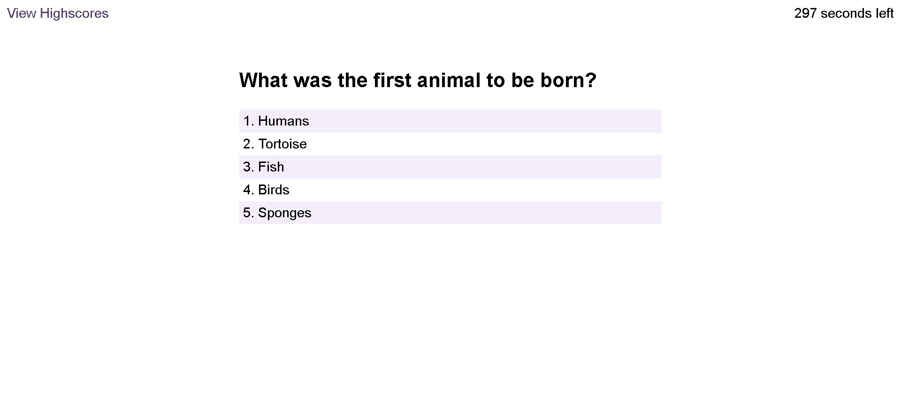
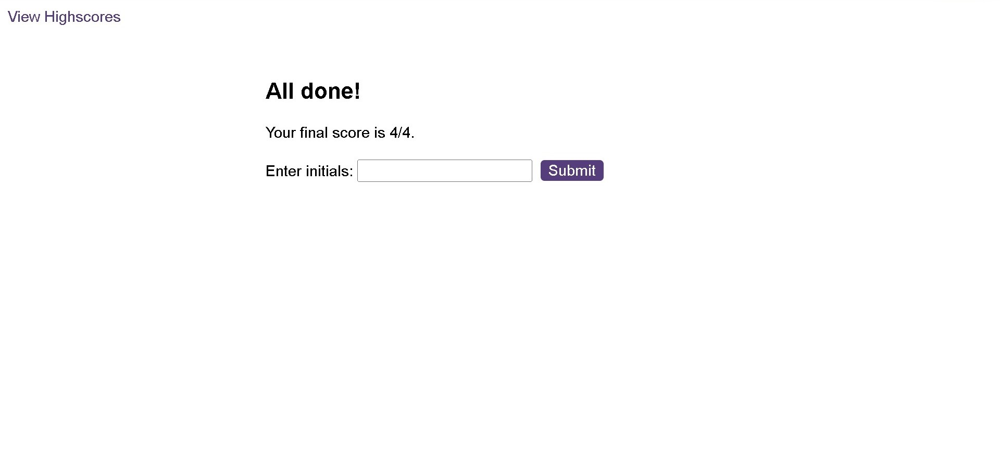

# Module 6 Challenge Web APIs: Code Quiz

## Description
 
The bootcamp challenge for this week was to build a timed coding quiz with multiple-choice questions.
  

## Installation

N/A

## Usage

To use code, you can review the javascript file above. To view the result of the code, you need to view them directly on the live web page by opening the Chrome DevTools by pressing Command+Option+I (macOS) or Control+Shift+I (Windows). A console panel should open either below or to the side of the webpage in the browser. There you will see the result of the code.

You can find the link to the deployed live webpage here: 
https://tala-ammoun.github.io/Module5Challenge/

Final Result:

### Step 1

### Step 2

## Credits

N/A 

## License

Licensed under the MIT license.

---
© 2022 edX Boot Camps LLC. Confidential and Proprietary. All Rights Reserved.
